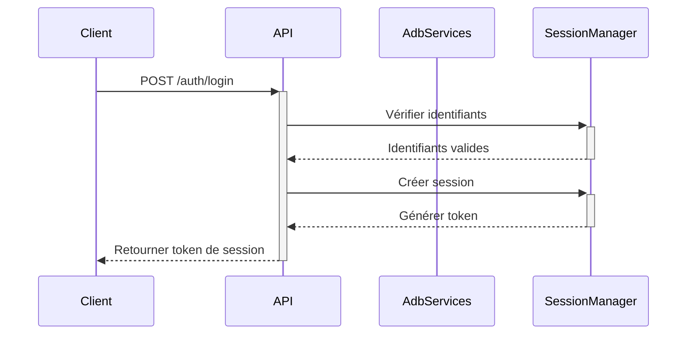
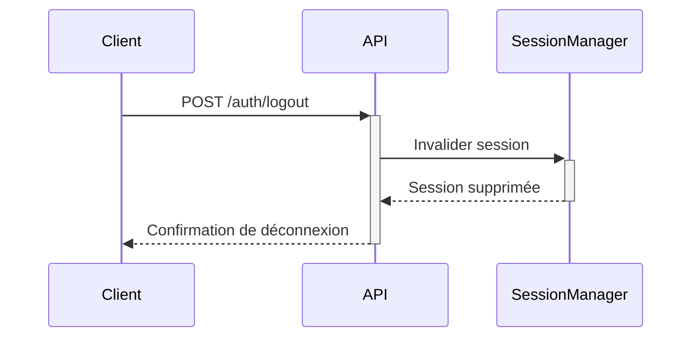
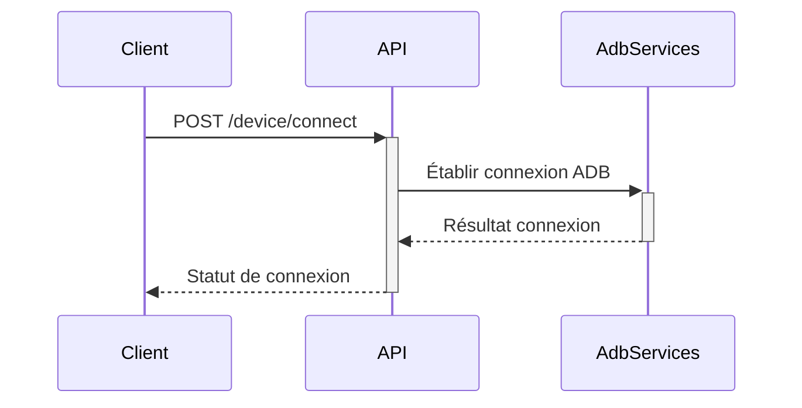
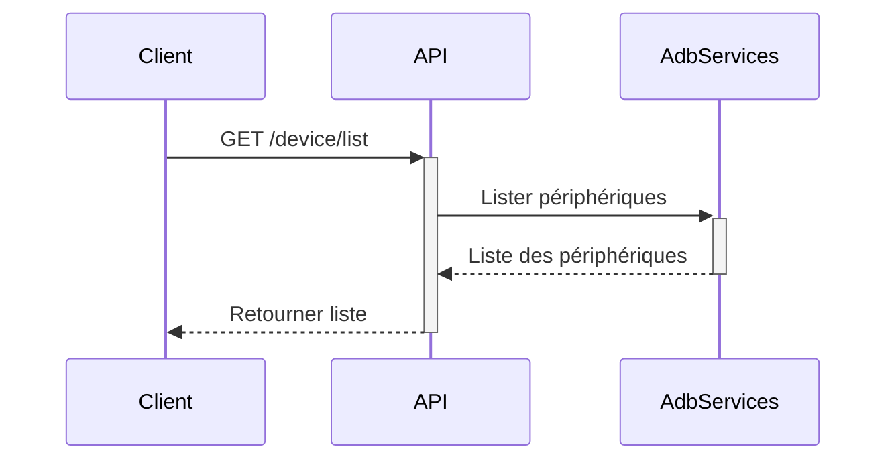
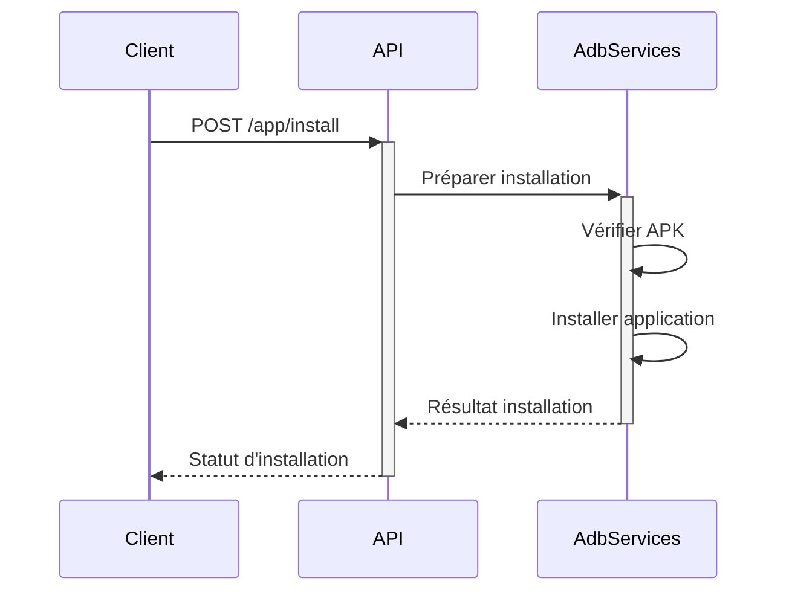
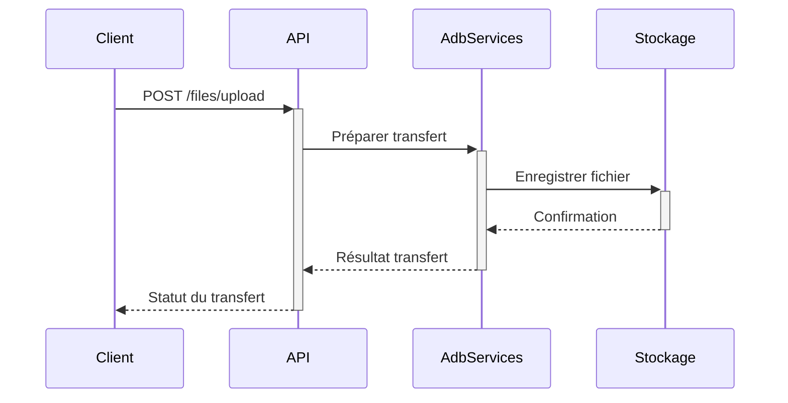
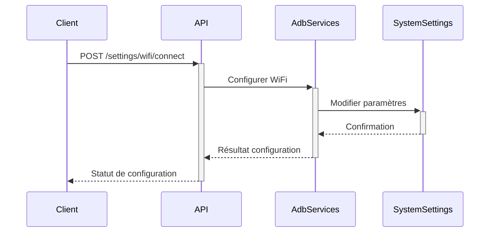
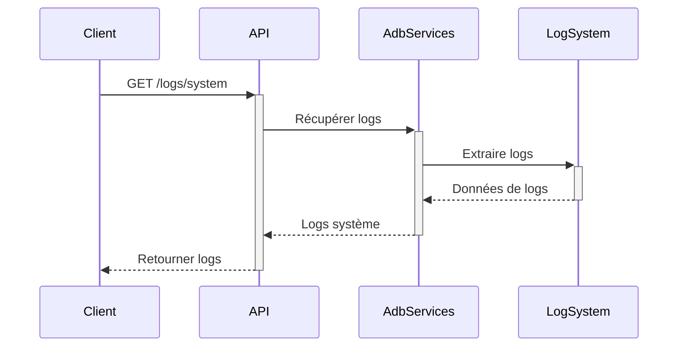

# Diagrammes d'Interactions de l'API ADB Dashboard

## Vue d'Ensemble des Interactions

Ce document décrit les principaux flux d'interactions entre les différents composants de l'API ADB Dashboard.

## Légende des Diagrammes

```
🟢 : Début de l'interaction
🔵 : Étape de traitement
🟠 : Décision/Condition
🔴 : Fin de l'interaction ou Erreur
➡️ : Flux d'interaction
```

## 1. Authentification et Gestion de Session

### Diagramme de Connexion



### Diagramme de Déconnexion



## 2. Gestion des Périphériques

### Diagramme de Connexion de Périphérique



### Diagramme de Liste des Périphériques



## 3. Gestion des Applications

### Diagramme d'Installation d'Application



## 4. Gestion des Fichiers

### Diagramme d'Upload de Fichier



## 5. Gestion des Paramètres Système

### Diagramme de Configuration WiFi



## 6. Gestion des Logs et Débogage

### Diagramme de Capture de Logs



## Principes de Sécurité

1. Toutes les interactions passent par l'API
2. Authentification requise pour la plupart des endpoints
3. Validation et assainissement des entrées
4. Gestion des erreurs et des exceptions
5. Tokens de session avec durée de vie limitée

## Considérations de Performance

- Utilisation de connexions ADB optimisées
- Mise en cache des résultats fréquents
- Gestion asynchrone des requêtes
- Limitation du nombre de connexions simultanées

## Notes Techniques

- Les diagrammes sont générés avec Mermaid
- Représentent les flux logiques principaux
- Ne montrent pas tous les détails d'implémentation

## Contribution

Pour mettre à jour ces diagrammes :
1. Modifier le fichier DIAGRAMMES_INTERACTIONS.md
2. Utiliser la syntaxe Mermaid
3. Tester la lisibilité et la précision

---

**Avertissement** : Ces diagrammes sont des représentations conceptuelles. L'implémentation réelle peut varier.
